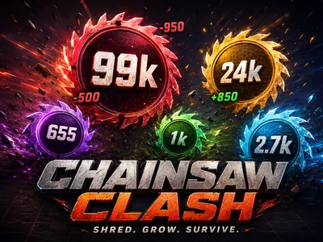
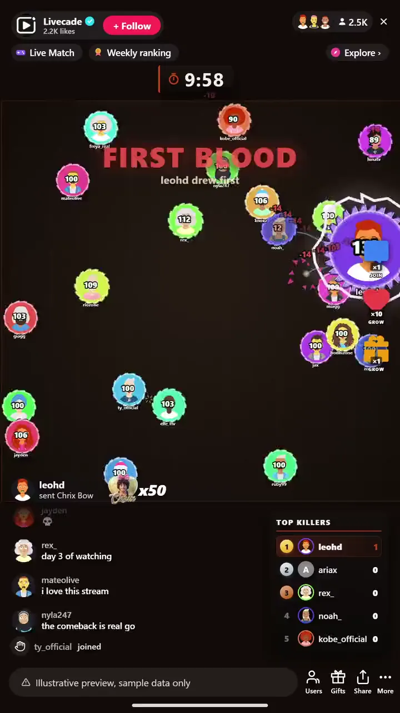

# Chainsaw Clash - Interactive TikTok Live Game

> Every viewer is a saw-blade blob in one shredding free-for-all.

Every viewer is a spinning-saw blob in one chaotic arena. Saws shred on contact, gifts upgrade your shell from chainsaw to buzzsaw to lightning, and floating damage numbers fly. Grow, dominate, survive.

**[Play Chainsaw Clash on Livecade](https://livecade.io/games/chainsaw-clash/?utm_source=github&utm_medium=readme&utm_campaign=chainsaw-clash)** - runs as a single browser source in OBS, Streamlabs, or TikTok LIVE Studio. Nothing for viewers to install.

## How viewers play

Viewers take part with the actions TikTok already gives them: **comments**, **gifts**, **likes**. Every action below is rebindable, so you decide which interaction drives which effect.

| Action | What it does |
| --- | --- |
| **Join** | Drops the viewer into the arena as a saw-blade blob |
| **Grow + upgrade shell** | Pumps HP into the sender's blob and upgrades its saw shell up a tier |

## How it works

### Everyone joins one arena

A comment drops the viewer in as a spinning-saw blob. It scales from a handful of players to a packed arena, and filler blobs keep it lively when the room is quiet.

### Gifts grow and upgrade you

Gifts pump HP and upgrade a blob's shell up the tiers, from chainsaw to buzzsaw to lightning, while likes chip in size. Everything is HP, so bigger means deadlier.

### Shred, streak, survive

Blades shred on contact and damage numbers fly. Kill streaks fire callouts, the leader gets a bounty on their head, and chaos events drop loot and sudden death.

## About the game

Chainsaw Clash throws every viewer into one arena as a spinning-saw blob. Blades shred on contact, so it is a constant scramble to hit harder than you get hit. Viewers join with a comment, then gifts pump HP and upgrade a blob's shell up the tiers, from chainsaw to buzzsaw to lightning, while likes chip in size.

### Leading makes you a target

The leader gets crowned with a bounty, kill-streak callouts fire on rampages, and chaos events drop loot and trigger frenzies and sudden death, with floating damage numbers flying the whole time.

### The arena is never empty

Run it endless or on a timer, with a live leaderboard and auto-spawned filler blobs so there is always something moving on screen.

## What it looks like on stream

[Watch Chainsaw Clash gameplay](https://cdn.livecade.io/games/chainsaw-clash.mp4)

## What you can configure

- **Interface language** - Twelve languages for the on-screen chrome
- **Game mode** - Endless play or a timed round
- **Round duration** - How long a timed round runs, in minutes
- **Starting blob size** - How big each blob spawns
- **Max blobs on arena** - Cap on how many blobs share the arena at once
- **HP per gift coin and size per like** - How much a blob grows from each gift coin and each like
- **Retire idle blobs** - Clear out blobs that have gone quiet after a delay you set
- **Kill-streak callouts** - DOUBLE KILL, RAMPAGE, and more as blobs rack up kills
- **Leader bounty** - Crown the leader with a big HP reward for whoever takes them down
- **Chaos events** - Loot drops, frenzies, and sudden death to shake up the arena
- **Auto-spawn filler blobs** - Keep the arena lively with no viewers, on an interval you set
- **Leaderboard** - Show a live top-blobs board, and how many entries
- **Background** - Transparent, a solid color, or your own image

## Languages

English, Spanish, Portuguese, French, German, Italian, Indonesian, Arabic, Turkish, Russian, Hindi, Romanian

## FAQ

<strong>How do viewers join Chainsaw Clash?</strong>

Viewers join with a comment in your TikTok Live chat and drop in as a saw-blade blob. It works for any audience size, and more players just make the arena more chaotic.

<strong>Do viewers have to send gifts to play?</strong>

No. Joining is free and comment-driven. Gifts pump HP and upgrade a blob's saw shell, and likes add size, which is what rewards gifting during a round.

<strong>What are the saw upgrades?</strong>

A blob's shell climbs the tiers as it grows, from chainsaw to buzzsaw to lightning. Since progression is all HP, a bigger blob hits harder and survives longer.

<strong>How do I add Chainsaw Clash to my TikTok Live?</strong>

Add one browser source URL to OBS or your streaming software and go live. There is no plugin to install and nothing for your viewers to download.

## Setup

1. [Create a Livecade account](https://app.livecade.io/register?utm_source=github&utm_medium=cta&utm_campaign=chainsaw-clash)
2. Copy your overlay browser source URL
3. Paste it into OBS, Streamlabs, or TikTok LIVE Studio
4. Pick Chainsaw Clash, set your triggers, and go live

Runs in the browser, so it works on Windows and macOS with nothing to download. [See all TikTok Live games](https://livecade.io/tiktok-live-games/?utm_source=github&utm_medium=readme&utm_campaign=chainsaw-clash).

---

_This repository documents Chainsaw Clash, a hosted interactive game by [Livecade](https://livecade.io/?utm_source=github&utm_medium=footer&utm_campaign=chainsaw-clash). The game runs on Livecade's platform, so there is no source to install here._
